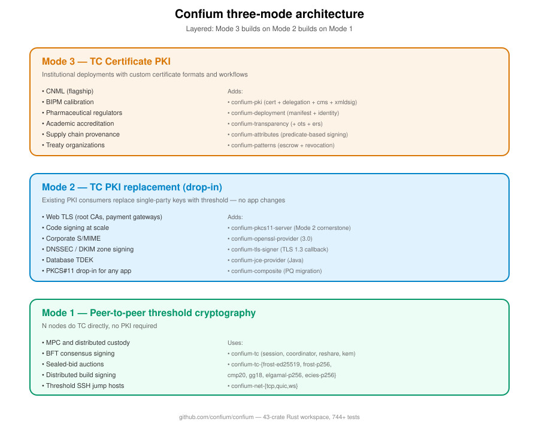

= Specification 00 — Framework overview
Ribose Inc. <open.source@ribose.com>
:sectnums:
:status: framework
:toc:

== What Confium is

Confium is an open-source framework for **multi-stakeholder threshold
cryptography**, providing the cryptographic, coordination, transparency,
and PKI primitives required for deployments where no single party is
trusted.

It is the reference implementation submitted to NIST MPTS
(Multi-Party Threshold Cryptography) standardization, and anchors the
OIML CNML (Certificat Numérique de Métrologie Légale) flagship
deployment under the OIML SMART program operated by Ribose.

== Three deployment modes

Confium supports three layered deployment modes. Each mode is a strict
superset of the previous mode's capabilities.

=== Mode 1 — Peer-to-peer threshold cryptography

N nodes on the internet do threshold cryptography directly with each
other. No PKI required, no hierarchy, no certificates (beyond mutual
TLS for transport authentication).

*Examples*: MPC, distributed key custody, BFT consensus signing,
sealed-bid auctions, threshold SSH jump hosts, distributed build signing.

=== Mode 2 — TC PKI replacement (drop-in)

Existing PKI consumers (web servers, code signers, email signers, VPN
gateways, PKCS#11 applications) replace single-party keys with threshold
keys **without changing their surrounding ecosystem**. Browsers still
verify TLS normally; OpenSSH still works; OpenSSL still works. The
PKCS#11 token they're talking to is actually a Confium threshold
coordinator dispatching to a quorum behind the scenes.

Includes the PQC migration path: composite signatures (classical + PQ)
maintain verifier back-compat.

*Examples*: web TLS for high-value sites, code signing at scale,
corporate S/MIME, DNSSEC, DKIM, CA root key management.

=== Mode 3 — TC Certificate PKI (special formats)

Organizations with their own certificate/document formats and workflow
semantics. Custom delegation rules, custom verification pipelines,
custom archival rules. CNML is the flagship.

*Examples*: OIML CNML, BIPM calibration, pharmaceutical regulator drug
approvals, academic accreditation, supply chain provenance, treaty
documents.

== Architecture diagram



(See `images/three-mode-architecture.svg` for the high-level layout.
Mode 3 builds on Mode 2 builds on Mode 1.)

== Layered architecture

```
Mode 3: TC Certificate PKI  (CNML, BIPM, pharma, accreditation)
   └─ adds: custom formats, scoped delegation, transparency, archival
        ↓ builds on
Mode 2: TC PKI replacement   (web TLS, code signing, PKCS#11, PQC migration)
   └─ adds: X.509 certs, CMS/TLS envelopes, PKCS#11 server, RFC compliance
        ↓ builds on
Mode 1: Peer-to-peer TC      (MPC, custody, BFT, wallets)
   └─ adds: nothing — pure protocol execution between authenticated peers
        ↓ builds on
Confium primitives           (sig + enc + reshare + coordinator + hardware)
```

== Crate organization

The main `confium/` Rust workspace contains 43 crates organized by
concern. See link:02-workspace-organization.adoc[02 — Workspace
organization] for the full layout.

== Implementation source

* Source: https://github.com/confium/confium
* RustDoc: https://docs.rs/confium (and per-crate)
* Engineering roadmap: https://github.com/confium/confium/tree/main/TODO.roadmap
* Cross-reference: `TODO.roadmap/26-confium-framework.md`

== Status

Confium 0.3 is structurally complete with 744+ tests passing. The
framework ships real cryptographic primitives (P-256 Shamir + ECDSA,
threshold ElGamal, threshold ECIES with ECDH + AES-256-GCM, real CMS
DER encoding, real Canonical XML, real RFC 6962 Merkle inclusion proofs)
plus interfaces for all planned algorithms.

Pre-1.0 work continues per `TODO.roadmap/68-roadmap-timeline.md`.
