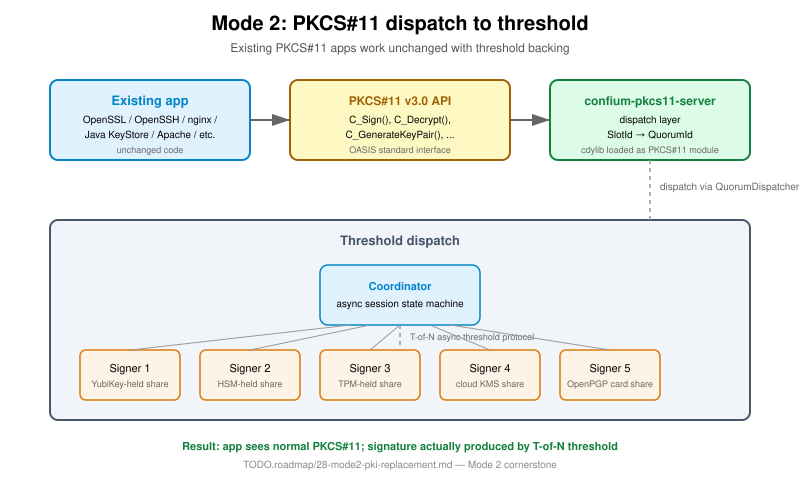

= Specification 11 — Mode 2: TC PKI replacement (drop-in)
Ribose Inc. <open.source@ribose.com>
:sectnums:
:toc:

== Definition

Existing PKI consumers (web servers, code signers, email signers, VPN
gateways, PKCS#11 applications) replace single-party keys with threshold
keys **without changing their surrounding ecosystem**.

== The killer feature: PKCS#11 dispatch

The application sees a normal PKCS#11 token. The PKCS#11 module
(`confium-pkcs11-server`) routes each call to a coordinator, which runs
the threshold protocol with the quorum and returns the result.

Existing apps work unchanged:

* OpenSSL (`C_Sign`, `C_Decrypt`)
* OpenSSH (agent protocol via PKCS#11)
* Java KeyStore (via JCE provider)
* nginx, Apache (via OpenSSL)
* Any PKCS#11 v3.0 consumer

== PQC migration

Mode 2 provides the PQ migration path that doesn't require replacing HSMs:

1. **Today**: deploy `confium-pkcs11-server` with classical algorithm
   (Ed25519, ECDSA P-256)
2. **Tomorrow**: software upgrade to composite signatures (classical + PQ)
3. **When ecosystem ready**: software upgrade to PQ-only

The PKCS#11 interface stays the same throughout. No app re-issuance,
no HSM replacement.

== Components

|===
|Component |Purpose |Status
|`confium-pkcs11-server` |PKCS#11 v3.0 dispatch to threshold |Dispatch layer shipped
|`confium-openssl-provider` |OpenSSL 3.0 provider |Interface
|`confium-tls-signer` |TLS 1.3 signature callback |Interface
|`confium-jce-provider` |Java Cryptography Extension |Interface
|`confium-composite` |Multi-alg composite signatures |Real Ed25519 verifier shipped
|===

== Deployment pattern

1. Deploy coordinator service (one per quorum)
2. Deploy Confium share daemons on threshold party machines
3. Install `confium-pkcs11-server` shared library on app machines
4. Configure app's PKCS#11 module path
5. App continues working unchanged

== Implementation source

* Crates: `confium-pkcs11-server`, `confium-openssl-provider`, `confium-tls-signer`, `confium-jce-provider`
* Example: `confium-examples/src/bin/pkcs11_server_demo.rs`
* Engineering doc: `TODO.roadmap/28-mode2-pki-replacement.md`
