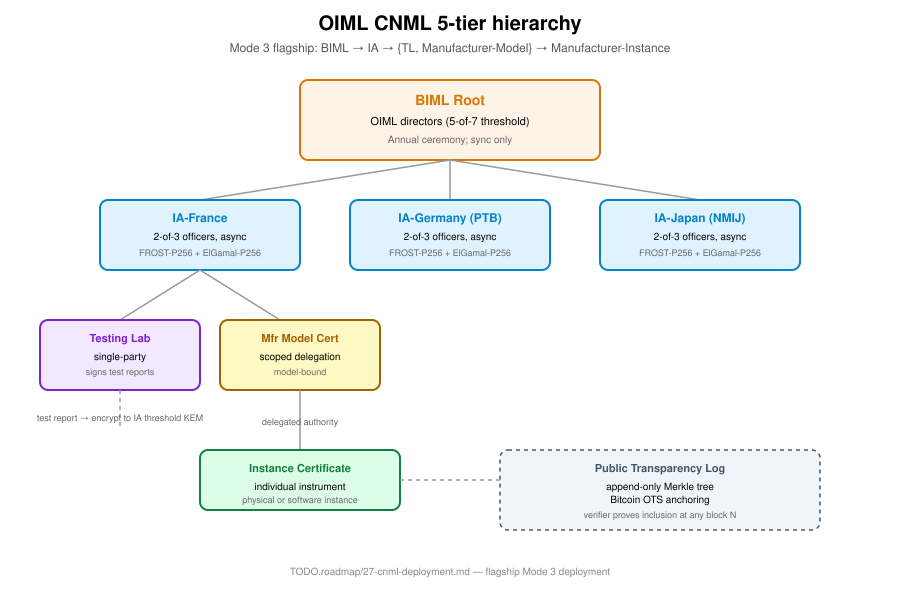

= Specification 12 — Mode 3: TC Certificate PKI
Ribose Inc. <open.source@ribose.com>
:sectnums:
:status: framework
:toc:

== Definition

Organizations with their own certificate/document formats and workflow
semantics. Custom delegation rules, custom verification pipelines,
custom archival rules.

== CNML flagship deployment



The CNML project is the Mode 3 flagship. It demonstrates Confium
at the highest-stakes end:

* International treaty organization (60+ member states)
* Nation-state adversary (both cyber and political)
* Decades-long archival
* Sovereignty sensitivity (no single nation trusted)
* Globally distributed directors (async signing required)
* Annual ceremony cadence

== Five-tier hierarchy

```
BIML Root (5-of-7, annual ceremony)
  └─→ IA Cert (2-of-3, async)
        ├─→ TL Cert (single-party)
        └─→ Manufacturer Model Cert (scoped delegation)
              └─→ Instance Cert (single-party, manufacturer-issued)
```

Each tier has its own threshold structure. See link:80-cnml-deployment.adoc[80 — CNML deployment]
for the full specification.

== Components specific to Mode 3

|===
|Component |Purpose
|`confium-pki` (cert + delegation + cms + xmldsig) |X.509, scoped delegation, CMS, XML signatures
|`confium-deployment` |Deployment manifest + actor identity
|`confium-transparency` |Merkle tree + OTS + ERS (transparency + long-term archival)
|`confium-attributes` |Attribute-based threshold party selection
|`confium-patterns` |Escrow + revocation (Thunderbird-inspired)
|===

== Deployment manifest

Mode 3 deployments are described by a TOML manifest encoding:

* Tier structure (number, names, roles)
* Quorum T/N per tier
* Attribute predicates (geography, expertise, COI)
* Delegation rules (depth, scope)
* Async signing policy
* Transparency log policy
* Archival / re-quorum cadence

See the link:https://github.com/confium/confium/tree/main/crates/confium-deployment[confium-deployment crate] for the
schema.

== Implementation source

* Crates: `confium-pki`, `confium-deployment`, `confium-transparency`, `confium-attributes`, `confium-patterns`
* Example: `confium-examples/src/bin/mini_cnml_demo.rs`
