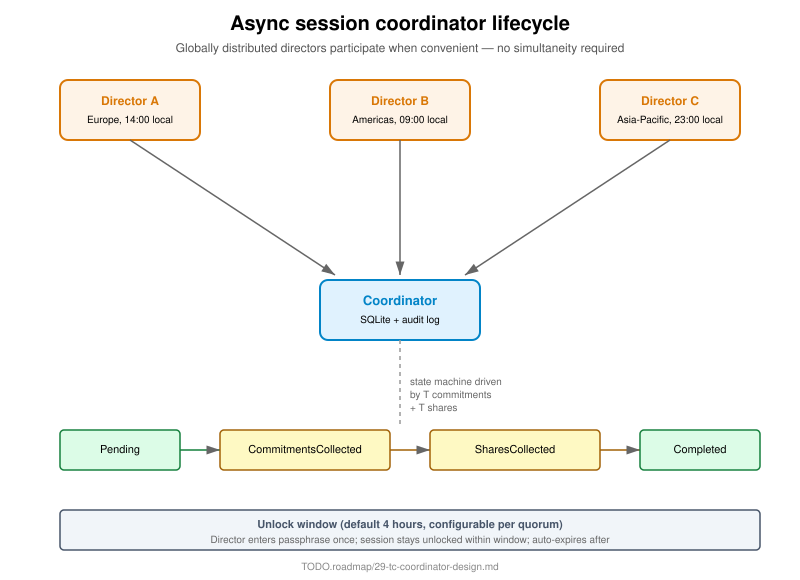

= Specification 22 — Threshold session lifecycle
:product: threshold
Ribose Inc. <open.source@ribose.com>
:sectnums:
:toc:

== Overview

A threshold session is the unit of interaction among T-of-N parties
producing a single cryptographic output (signature, decryption, etc.).

== Session types

|===
|Type |Phases |Use case
|DKG (Distributed Key Generation) |3 rounds |Initial keypair creation
|Signing |2-3 rounds |Produce a signature
|Decryption |1-2 rounds |Decrypt a ciphertext
|Re-sharing |2-3 rounds |Change committee without changing public key
|Refresh |1 round |Proactive share refresh (Herzberg)
|===

== State machine



```
Pending
  ↓ (T commitments received)
CommitmentsCollected
  ↓ (T shares received)
SharesCollected
  ↓ (aggregation)
Completed
```

Or:

```
Pending
  ↓ (unlock window expired)
Expired
```

== Message types

Each session involves these messages:

1. **SessionInit** — created by requester, contains message + quorum ID + threshold
2. **Commitment** — round 1 output from each signer
3. **Share** — round 2 output from each signer
4. **AggregatedSignature** — final output

Every message is signed by the sender's identity key for non-repudiation.

== Identifiable abort

If a party sends an invalid message, the protocol aborts and emits a
signed proof of misbehavior:

* Identifies the offending party
* Includes their signed offending message
* Includes the round transcript up to abort

This proof is sufficient for administrative proceedings.

== Cross-references

* Engineering doc: `TODO.roadmap/04-threshold-cryptography.md`
* Coordinator spec: link:23-async-coordinator.adoc[23 — Async coordinator]
* Re-sharing spec: link:24-share-reshare.adoc[24 — Share re-sharing]
* Implementation: `confium-tc/src/session.rs`
