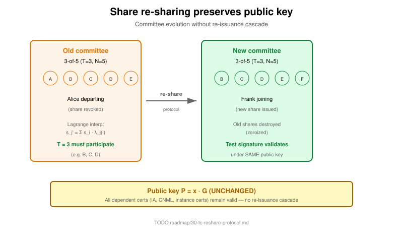

= Specification 24 — Share re-sharing
:product: threshold
:status: accepted
:implementation: shipped
Ribose Inc. <open.source@ribose.com>
:sectnums:
:toc:

== Two distinct operations

|===
|Operation |What changes |Public key |When
|Re-sharing |Committee composition (add/remove party) |**Unchanged** |Any time
|Proactive refresh |All shares refreshed; committee same |**Unchanged** |Periodic
|Root renewal |Root keypair itself |**New keypair** |Rare
|===

== Why re-sharing preserves the public key



Re-sharing works by Lagrange interpolation. T current directors
collaboratively compute new shares without revealing the original secret:

```
For each new party q_j in C_new:
  s_j_new = Σ over participating-i of (Lagrange_basis(j, i) * s_i_old)
```

The aggregate secret is unchanged because the Lagrange interpolation
evaluates to the same value at x=0. Therefore the public key
`P = secret · G` is unchanged.

== Scheduling

|===
|Trigger |Type |Sync?
|Director term expires |Routine |Sync (annual ceremony)
|Director dies / resigns |Emergency |Async
|Director YubiKey lost |Emergency |Async
|Director compromised |Emergency |Async
|Periodic refresh |Routine |Async (monthly/quarterly)
|Quorum policy change |Routine |Sync (annual ceremony)
|===

== Why this matters

Without re-sharing preserving the public key, every director change
would invalidate hundreds of dependent certificates. With re-sharing:

* Public key stays the same
* All existing certs remain valid
* No re-issuance cascade

This is the operational enabler for long-term institution-grade
threshold crypto.

== Implementation source

* Crate: `confium-tc` (reshare submodule)
* Algorithm: Lagrange interpolation over P-256 scalar field
