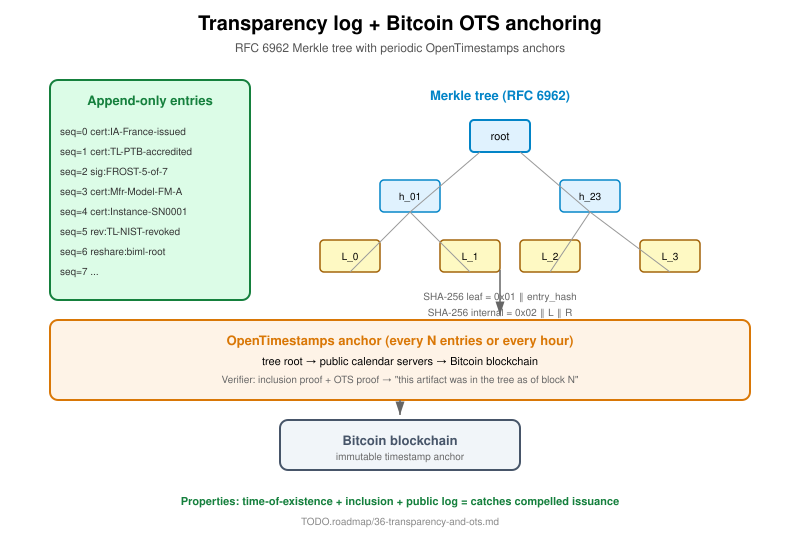

= Specification 42 — Transparency log (RFC 6962 Merkle tree)
:product: transparency
:status: accepted
:implementation: shipped
Ribose Inc. <open.source@ribose.com>
:sectnums:
:toc:

== Purpose

Prove every issued artifact was publicly logged. Catches compelled
issuance, rogue issuance, retroactive forgery.

== Architecture



Simpler than CT-style gossip. No academic witness network required.
Append-only Merkle tree with Bitcoin-anchored roots.

== Merkle tree (RFC 6962)

Leaf hash: `SHA-256(0x01 ‖ entry_hash)`
Internal hash: `SHA-256(0x02 ‖ left_hash ‖ right_hash)`

The 0x01/0x02 domain separation prevents second-preimage attacks.

== Inclusion proofs

An inclusion proof for leaf at sequence N is a list of `(sibling_hash, side)`
pairs from leaf level up to root:

```
proof = [
  (sibling_0, Right),  # at leaf level, sibling is to the right
  (sibling_1, Left),   # at level 1, sibling is to the left
  ...
]
```

Verifier reconstructs the root by combining leaf + siblings in the
correct order:

```
current = leaf_hash
for (sibling, side) in proof:
  if side == Left:
    current = SHA-256(0x02 ‖ sibling ‖ current)
  else:
    current = SHA-256(0x02 ‖ current ‖ sibling)
verify current == root
```

== OTS anchoring

Every N entries (or every hour), the tree root is committed to Bitcoin
via OpenTimestamps. The proof is:

1. **Time**: OTS proves root existed at Bitcoin block N
2. **Inclusion**: Merkle branch proves artifact in tree at root
3. **Public log**: tree published; missing artifacts detectable

A malicious CA cannot silently issue a fraudulent cert because:

* If they DON'T log it, verifier can't validate (cert not in tree)
* If they DO log it, public sees the issuance
* If they try to rewrite history, Bitcoin anchor catches it

== Implementation source

* Crate: `confium-transparency` (merkle submodule)
* Test vectors: `crates/confium-transparency/tests/integration.rs`
